# Latihan PHP


Halo halo, Sekarang disini akan mencoba menggunakan PHP.
Cek juga repo lain yang membahas
 [Html dasar](https://github.com/laLafid/Lab1Web), [CSS dasar](https://github.com/laLafid/lab2web), [CSS](https://github.com/laLafid/Lab3Web), [CSS Layout](https://github.com/laLafid/Lab4Web), [Dasar Javascript](https://github.com/laLafid/Lab5Web) dan [Dasar Bootstarp](https://github.com/laLafid/Lab6Web)


## Langkah-langkah

1. **Siapkan Editor**
    - Misal Visual Studio Code.
    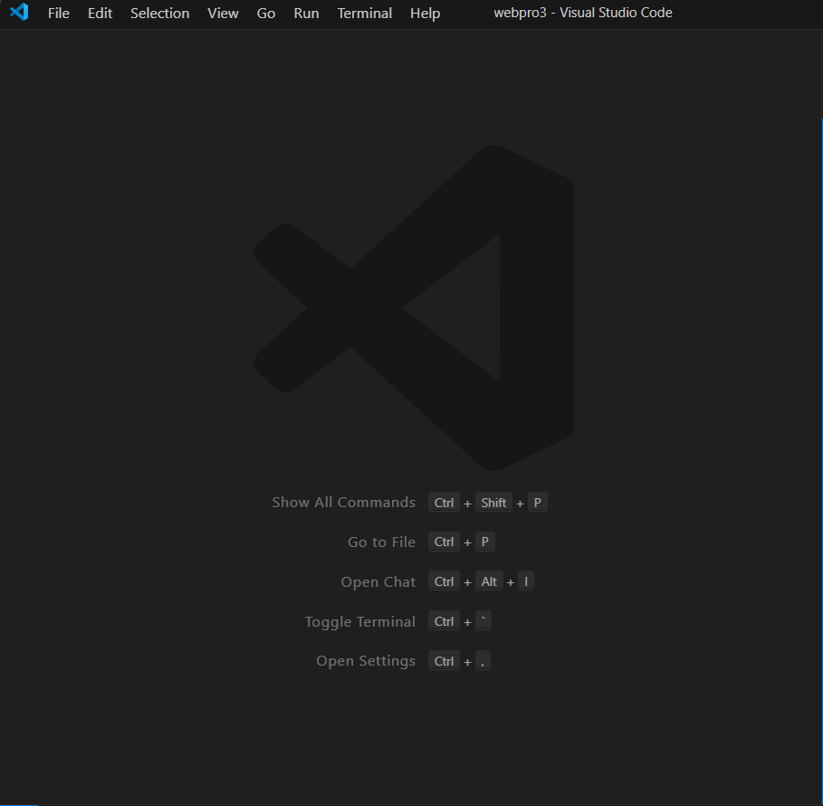

2. **Buat kerangka baru**
    - Buat file baru `belajar.php` dan masukkan struktur HTML dasar dengan php:
    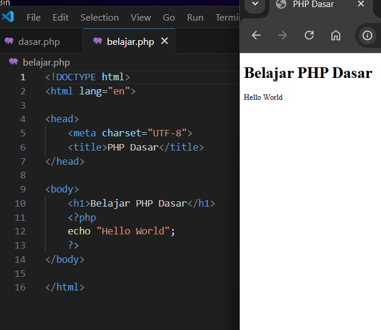

3. **ePHP**

    - Membuat Variable
    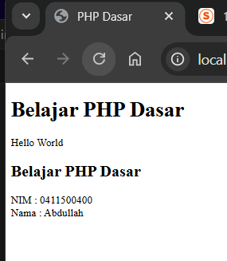

    nambahin variable php seperti $nim dan $nama lalu menampilkannya lewat echo. 
    
    ```php
    <h2>Variable</h2>
    <?php
    $nim = "0411500400";
    $nama = 'Abdullah';
    echo "NIM : " . $nim . "<br>";
    echo "Nama : $nama";
    ?>
    ```

    - Predefined $_GET
    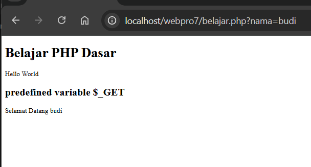

    pake $_GET saya cuma bisa nampilin namanya kalau edit URL jadi '''http://localhost/webpro7/belajar.php?nama=budi''' dengan nambahin '?nama=budi' ke url yang ada baru $_GET bisa jalan.
    
    ```php
    <h2>predefined variable $_GET</h2>
    <?php
    echo 'Selamat Datang ' . $_GET['nama'];
    ?>
    ```

    - Form Input

    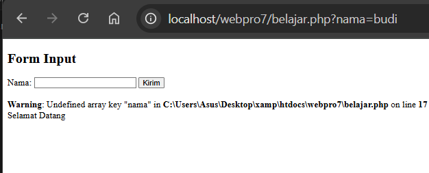
    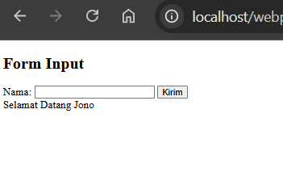
    

    nambahin form input nama dan nampilin nama/teks yang di input.

    ```php
    <h2>Form Input</h2>
    <form method="post">
        <label>Nama: </label>
        <input type="text" name="nama">
        <input type="submit" value="Kirim">
    </form>
    <?php
    echo 'Selamat Datang ' . $_POST['nama'];
    ?>
    ```

    - Pakai Operator
    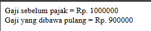

    untuk hitung slip gaji.

    ```php
    <?php
    $gaji = 1000000;
    $pajak = 0.1;
    $thp = $gaji - ($gaji * $pajak);
    echo "Gaji sebelum pajak = Rp. $gaji <br>";
    echo "Gaji yang dibawa pulang = Rp. $thp";
    ?>
    ```
    
    - Penggunaan kondisi If dan Switch
      

    

    kondisi if di set default/'l'.

    ```php
    <?php
    $nama_hari = date("l");
    if ($nama_hari == "Sunday") {
        echo "Minggu";
    } elseif ($nama_hari == "Monday") {
        echo "Senin";
    } else {
        echo "Selasa";
    }
    ?>
    ```


    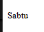

    kondisi switch di set default/'l'.

    ```php
    <?php
    $nama_hari = date("l");
    switch ($nama_hari) {
        case "Sunday":
            echo "Minggu";
            break;
        case "Monday":
            echo "Senin";
            break;
        case "Tuesday":
            echo "Selasa";
            break;
        default:
            echo "Sabtu";
    }
    ?>
    ```

    - Kompilasi perulangan
      


    Perulangan for untuk hitung dari 1 sampai 10.

    ```php
    <?php
    echo "Perulangan 1 sampai 10 <br />";
    for ($i = 1; $i <= 10; $i++) { //mulai dari 1; jika nilai kurang dari atau sama dengan 10; tambah nilai 1
        echo "Perulangan ke: " . $i . '<br />';
    }
    echo "Perulangan Menurun dari 10 ke 1 <br />";
    for ($i = 10; $i >= 1; $i--) { //mulai dari 10; jika nilai lebih dari atau sama dengan 1; kurangi 1
        echo "Perulangan ke: " . $i . '<br />';
    }
    ?>
    ```
    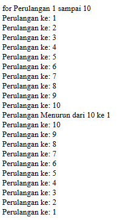


    Perulangan while untuk hitung dari 1 sampai 10.

    ```php
    <?php
    echo "Perulangan 1 sampai 10 <br />";
    $i = 1;
    while ($i <= 10) { //kalau masih kurang dari 10
        echo "Perulangan ke: " . $i . '<br />'; 
        $i++; // jalanin ini
    }
    ?>
    ```
    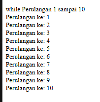


   Perulangan do while untuk hitung dari 1 sampai 10.

    ```php
    <?php
    echo "Perulangan 1 sampai 10 <br />";
    $i = 1;
    do { // jalanin ini
        echo "Perulangan ke: " . $i . '<br />';
        $i++; 
    } while ($i <= 10); // kalau masih begini
    ?>
    ```
    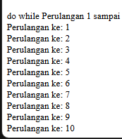
    
 

4. **Hasil Akhir**

    ini berisi Form html untuk input dan proses PHP untuk nampilin nama, hitung umur dan gaji.
    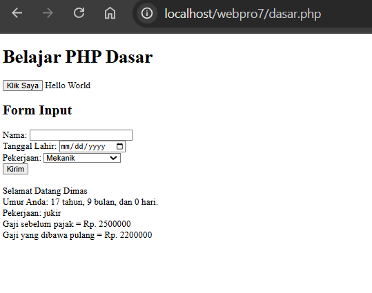

    
## Akhri Kata

Di bawah ini latihan yang sudah dikerjakan: 

1. [Program PHP hitung umur dan gaji berdasarkan pekerjaan](dasar.php)


*Selamat mencoba*
